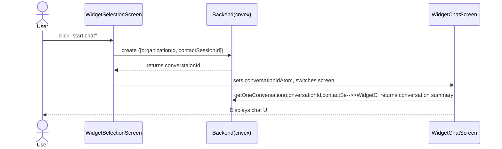

### widget screen Router - Jotai

1. `pnpm -F widget add jotai`
2. add `provider` to 'apps\widget\components\providers.tsx'
3. create widget atoms --> 'apps\widget\modules\widget\ui\atoms\widget-atoms.ts'
4. define screens in 'apps\widget\modules\widget\ui\screens' folder
5. create screen router in 'apps\widget\modules\widget\ui\views\widget-view.tsx'
6. Widget Loading part
   1. create error screen
      1. add `errorMessageAtom` in 'apps\widget\modules\widget\ui\atoms\widget-atoms.ts'
      2. create '/apps/widget/modules/widget/ui/screens/widget-error-screen.tsx'
      3. add `<WidgetErrorScreen />` to 'apps\widget\modules\widget\ui\views\widget-view.tsx'
   2. add convex function `organization.getOne()` and `contactSessions.validate()`
      1. `pnpm -F backend add @clerk/backend`
      2. add `validate` to 'packages\backend\convex\public\contactSessions.ts'
      3. create 'apps\widget\modules\widget\ui\screens\widget-auth-screen.tsx'
   3. create Loading screen
      1. create `organizationId`
         1. create 'packages\backend\convex\public\organization.ts'
         2. add `CLERK_SECRET_KEY` to 'packages\backend\.env.local'(can copy from 'apps\web\.env.local')
         3. go to [convex dashboard](https://dashboard.convex.dev/)  --> setting --> Environment Variables --> add button: add `CLERK_SECRET_KEY`
      2. validation `organizationId`     --> verify organization
         1. in [convex dashboard](https://dashboard.convex.dev/):  funtions --> choose 'organization:validate' --> 'Run Function' button
         2. https://docs.convex.dev/functions/actions
      3. Loading `contactSessionId`   --> verify contact session
      4. create 'apps\widget\modules\widget\ui\views\widget-loading-screen.tsx'
         1. add loading screen to 'apps\widget\modules\widget\ui\views\widget-view.tsx'
   4. create Conversation(selection) screen
      1. add `conversations` to schema('packages\backend\convex\schema.ts')
         1. `turbo dev` --> prepare, ready and validate schema
      2. add `conversations` functions(create 'packages\backend\convex\public\conversations.ts')
         1. `turbo dev` --> prepare, ready and validate functions
         2. https://docs.convex.dev/functions/error-handling/application-errors
      3. add selection screen
         1. create 'apps\widget\modules\widget\ui\views\widget-selection-screen.tsx'
         2. add selection screen to 'apps\widget\modules\widget\ui\views\widget-view.tsx'
         3. add `` to 'packages\backend\convex\schema.ts'
            1. create `conversations` table
         4. create 'packages\backend\convex\public\conversations.ts'
            1. create `createConversation`, `getOneConversation` and `getManyConversations` functions
         5. create apps\widget\modules\widget\ui\views\widget-chat-screen.tsx'
            1. user-defined button- add `transparent` to `variants` in 'packages\ui\src\components\button.tsx'

