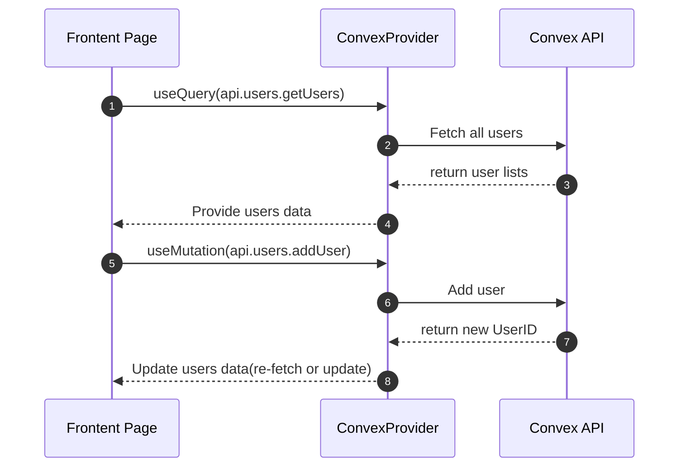
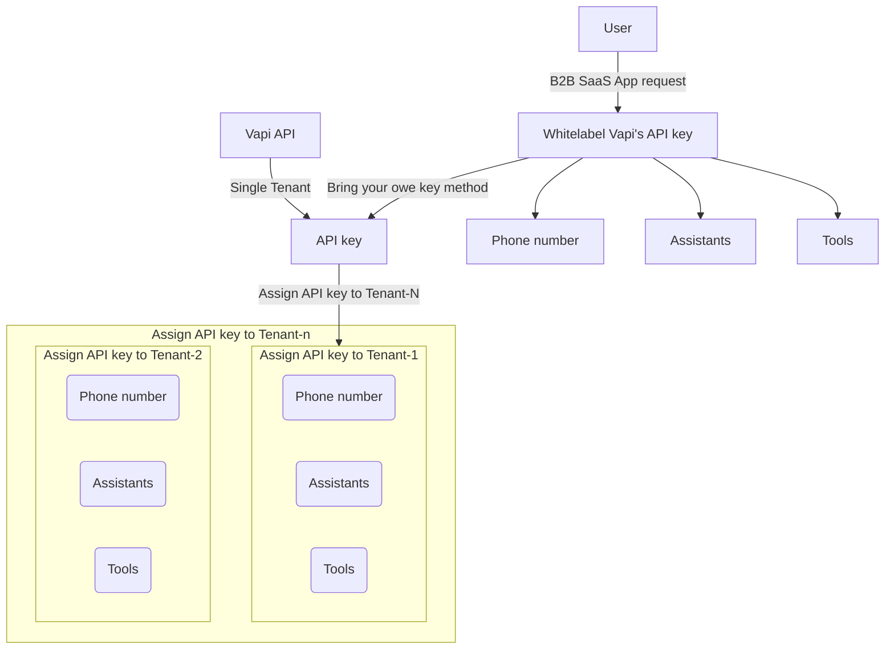
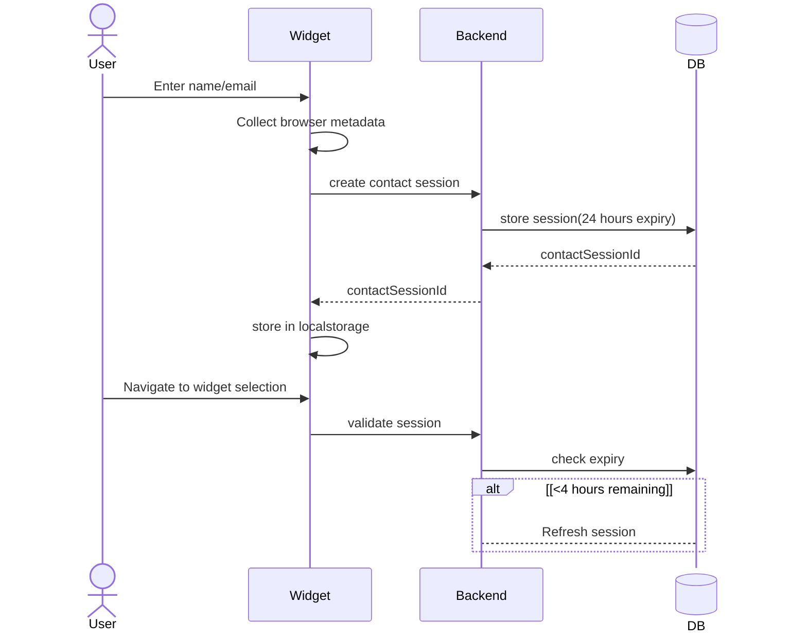

- [creat a monorepo project using shadcn](#creat-a-monorepo-project-using-shadcn)
- [Convex integration](#convex-integration)
- [Clerk Authentication integration](#clerk-authentication-integration)
- [Clerk sign-in/up customize and organization](#clerk-sign-inup-customize-and-organization)
- [Error Tracking](#error-tracking)
- [AI Voice Assistant- Vapi](#ai-voice-assistant--vapi)
- [Dashboard Layout](#dashboard-layout)
- [Widget App](#widget-app)
  - [Widget Layout](#widget-layout)
  - [Widget session](#widget-session)

----------------------------------------------------------

## creat a monorepo project using shadcn

1. init project by using [shadcn with monorepo](https://ui.shadcn.com/docs/monorepo)
   - `pnpm dlx shadcn@latest init --monorepo`
     - create a new monorepo project with two workspaces: `web` and `ui`, and **Turborepo** as the build system
   - create another app(widget)
     1. copy 'web' folder and rename as 'widget'
     2. change to `"name": "widget",` of '\apps\widget\package.json'
     3. `pnpm install`
2. add shadcn component to project
  1. `cd apps/web/
  2. `pnpm dlx shadcn@latest add input`
     1. will create 1 file: '\packages\ui\src\components\input.tsx'
3. [Creating an Internal Package](https://turborepo.dev/docs/crafting-your-repository/creating-an-internal-package)
  1. create 'packages\math' folder
  2. create '\packages\math\package.json'
  3. create '\packages\math\tsconfig.json'
  4. create '\packages\math\src\a.ts'
  5. add ` "@workspace/math": "workspace:*",` to 'apps\web\package.json'
  6. `pnpm install`   <-- **importance**
  7. using in other app
     1. add following codes to 'apps\web\app\page.tsx'
     2. `import { add } from "@workspace/math/add";`
     3. `<p>{add(1, 2)}</p>`

- References
  - [turborepo](https://turborepo.dev/docs): monorepo build system
  - [shadcn in monorepo](https://ui.shadcn.com/docs/monorepo)

```json
// package.json
{
  "name": "@workspace/math",    // change repo to workspace
  "type": "module",
  "scripts": {
    "dev": "tsc --watch",
    "build": "tsc"
  },
  "exports": {
    "./add": {
      "types": "./src/add.ts",
      "default": "./dist/add.js"
    }
  },
  "devDependencies": {
    "@workspace/typescript-config": "workspace:*",   // change repo to workspace
    "typescript": "latest"
  }
}
//tsconfig.json
{
  "extends": "@workspace/typescript-config/base.json",   // change repo to workspace
  "compilerOptions": {
    "outDir": "dist",
    "rootDir": "src"
  },
  "include": ["src"],
  "exclude": ["node_modules", "dist"]
}
//src/add.ts
export const add = (a: number, b: number) => a + b;
//using math inter package in app, such as apps\web\app\page.tsx
import { add } from "@workspace/math/add";
   //...
<p>{add(2, 3)}</p>
```

[🚀back to top](#top)

## Convex integration

1. `pnpm build`  👉 check whether there is missing dependencies
   1. run `pnpm -F eslint-config add --save-dev @esling/js` if missing dependencies
2. setup Convex backend: refer to https://github.com/get-convex/turbo-expo-nextjs-clerk-convex-monorepo
   1. create 'packages\backend' folder
   2. create 'packages\backend\package.json' file
   3. `pnpm install`
   4. `pnpm -F backend add convex`
   5. `pnpm -F backend run setup` --> choose create new project
      1. 👉will create '.env.local' file
      2. 👉will create a 'convex' folder
3. Test Convex:
   1. create 'packages\backend\convex\schema.ts' file
   2. create 'packages\backend\convex\users.ts' file
   3. `turbo dev`
   4. check [convex dashboard](https://dashboard.convex.dev/) whether there is table and function
4. using convex backend api in web/app: refer to [Convex+Next.js-official](https://docs.convex.dev/quickstart/nextjs)
   1. modification in convert/backend
      1. create 'packages\backend\tsconfig.json'
      2. modify 'packages\backend\package.json'
   2. add convex to web/app
      1. `pnpm -F web add convex`  👉 convex will be added to 'apps\web\package.json'
      2. `pnpm install`  👉 install dependency of convex for web/app
   3. modification in web/app
      1. add `"@workspace/backend": "workspace:*",` to 'apps\web\package.json'
      2. add `"@workspace/backend/*": ["../../packages/backend/convex/*"]` to 'apps\web\tsconfig.json'
      3. create 'apps\web\.env.local'
      4. add `ConvexProvider` to 'apps\web\components\providers.tsx'
      5. modify 'apps\web\app\page.tsx' to use backend api, query data and display data
5. using convex backend api in widget/app
   1. add convex to web/app
      1. `pnpm -F widget add convex`  👉 convex will be added to 'apps\web\package.json'
      2. `pnpm install`  👉 install dependency of convex for web/app
   2. modification in widget/app
      1. add `"@workspace/backend": "workspace:*",` to 'apps\widget\package.json'
      2. add `"@workspace/backend/*": ["../../packages/backend/convex/*"]` to 'apps\widget\tsconfig.json'
      3. create 'apps\widget\.env.local'
      4. add `ConvexProvider` to 'apps\widget\components\providers.tsx'
      5. modify 'apps\widget\app\page.tsx' to use backend api, query data and display data



```ts
// packages\backend\package.json
{
  "name": "@workspace/backend",
  "type": "module",
  "scripts": {
    "dev": "convex dev",
    "setup": "convex dev --until-success"
  },
  "exports": {
    "./convex": "./convex/*.ts"
  },
  "devDependencies": {
    "@workspace/typescript-config": "workspace:*",
    "typescript": "latest"
  },
  "dependencies": {
    "convex": "^1.32.0"
  }
}
// packages\backend\tsconfig.json
{
  "extends": "@workspace/typescript-config/base.json",
  "compilerOptions": {
    "baseUrl": ".",
    "paths": {
      "@workspace/backend/*": ["./convex/*"]
    }
  },
  "include": ["."],
  "exclude": ["node_modules"]
}
```

[🚀back to top](#top)

## Clerk Authentication integration

1. **backend side**
   1. `pnpm -F backend add --save-dev @types/node`
   2. [Clerk Dashboard](https://dashboard.clerk.com/)
      1. Create an application
      2. Activate the Convex integration  👉 click button 'Activate Convex integration' in new application
      3. add 'jwt template'
         - 
         - copy **'Issuer'** url to `CLERK_JWT_ISSUER_DOMAIN` in 'packages\backend\.env.local'
   3. [convex dashboard](https://dashboard.convex.dev/)
      - add environment vaiables
      - 
   4. Configure Convex with the Clerk issuer domain
      1. Create 'packages\backend\convex\auth.config.ts'
      2. `turbo dev'   👉  - sync configuration to  backend
2. **web app side**
   1. `pnpm -F web add @clerk/nextjs`
   2. In the Clerk Dashboard, navigate to the API keys page, copy `NEXT_PUBLIC_CLERK_PUBLISHABLE_KEY` and `CLERK_SECRET_KEY` environment variables to 'apps\web\.env.local'
   3. Add Clerk middleware   👉 Create a 'apps\web\middleware.ts'
   4. Configure ConvexProviderWithClerk  👉 create 'apps\web\components\ConvexClientProvider.tsx`
   5. Wrap app in Clerk and Convex(ConvexProviderWithClerk)  👉 modify 'apps\web\app\layout.tsx'
   6. Show UI based on authentication state  👉 modify 'apps\web\app\page.tsx'
   7. Customize you own sign-in/sign-up(nextjs+clerk)
      1. modify 'apps/web/middleware.ts', add `isPublicRoute`
      2. create 'apps/web/app/(auth)/sign-in/[[...sign-in]]/page.tsx'
      3. create 'apps/web/app/(auth)/sign-up/[[...sign-up]]/page.tsx'
      4. create 'apps/web/app/(auth)/layout.tsx'
      5. adding to 'apps/web/.env.local'
         1. `NEXT_PUBLIC_CLERK_SIGN_IN_URL=/sign-in`
         2. `NEXT_PUBLIC_CLERK_SIGN_IN_FALLBACK_REDIRECT_URL=/`
         3. ...
      6. https://clerk.com/docs/nextjs/guides/development/custom-sign-in-or-up-page
- **References**
  - https://docs.convex.dev/auth/clerk#nextjs
  - https://clerk.com/docs/nextjs/getting-started/quickstart

[🚀back to top](#top)

## Clerk sign-in/up customize and organization

1. customization of sign-in/sign-up
   1. adjust codes structure
   2. create folders and files according to following
2. organization
   1. add organization codes in middleware('apps\web\proxy.ts')
   2. add `OrganizationSwitcher` to 'apps\web\app\(dashboard)\page.tsx'
   3. add `orgId` to JWT templates in clerk dashboard
   4. 

```
├── 📂 apps\web\app\
│     ├──  📂 (auth)\
│     │    ├──  📂 org-selection\[[...org-selection]]\
│     │    │      └── 📄 page.tsx
│     │    ├──  📂 sign-in\[[...sign-sign-inin]]\
│     │    │      └── 📄 page.tsx
│     │    ├──  📂 sign-up\[[...sign-up]]\
│     │    │      └── 📄 page.tsx
│     │    └── 📄 layout.tsx                         -> authentication page layout
│     ├──  📂 (dashboard)\
│     │    ├── 📄 layout.tsx                         -> homepage layout
│     │    └── 📄 page.tsx                           -> home page
│     ├──  📂 module\auth\ui\
│     │       ├──  📂 components\
│     │       │      ├── 📄 auth-guard.tsx
│     │       │      └── 📄 organization-guard.tsx
│     │       ├──  📂 layouts\
│     │       │      └── 📄 auth-layout.tsx           -> authentication page layout
│     │       ├──  📂 views\
│     │       │      ├── 📄 org-selection-view.tsx
│     │       │      ├── 📄 sign-in-view.tsx
│     │       │      └── 📄 sign-up-view.tsx
-----------------------
├── 📂 packages\backend\apconvex\
│     ├── 📄 user.ts
```

## Error Tracking

1. `cd apps/web`
2. `pnpm dlx @sentry/wizard@latest -i nextjs`
3. add `SENTRY_AUTH_TOKEN` to 'apps\web\.env.local'
4. add `.env.sentry-build-plugin` to '.gitignore'
- [sentry with nextjs](https://docs.sentry.io/platforms/javascript/guides/nextjs/)

[🚀back to top](#top)

## AI Voice Assistant- Vapi

1. setup Vapi in [Vapi dashboard](https://dashboard.vapi.ai/)
   - add knowledge base
   - add tools
   - following steps of [Vapi Inbound customer support](https://docs.vapi.ai/assistants/examples/inbound-support)
2. integrate Vapi in apps/widget
   1. `pnpm -F widget add @vapi-ai/web`
   2. create hook(`useVapi`) in 'apps\widget\modules\widget\hooks\use-vapi.ts'
      1. create a **new public API** in Vapi dashboard and use it as `vapiInstance` in 'use-vapi.ts
         1. 
      2. copy **Assistants ID** and use it `startCall()` function in in 'use-vapi.ts
   3. use hook(`useVapi`) in 'apps\widget\app\page.tsx'
- [Vapi Inbound customer support](https://docs.vapi.ai/assistants/examples/inbound-support)
- https://docs.vapi.ai/guides



[🚀back to top](#top)

## Dashboard Layout

1. `cd apps/web`
2. `pnpm dlx shadcn@4.0.0 add --all`
3. [theme toggle](https://ui.shadcn.com/docs/dark-mode/next)
   1. create 'apps\web\components\ModeToggle.tsx'
   2. add `ThemeProvider` to 'apps\web\app\(dashboard)\layout.tsx'
   3. add `ModeToggle` to 'apps\web\app\modules\auth\ui\dashboard\ui\layouts\dashboard-layout.tsx'
4. dashboard layout
   1. back to root directory and run `pnpm install`
   2. create directories and files according following

```
├── 📂 apps\web\app\(dashboard)\
│     ├──  📂 converastions\
│     │    └── 📄 page.tsx
│     ├──  📂 customization\
│     │    └── 📄 page.tsx
│     ├──  📂 files\
│     │    └── 📄 page.tsx
│     ├──  📂 integrations\
│     │    └── 📄 page.tsx
│     ├──  📂 plugins\
│     │    └──  📂 vapi\
│     │         └── 📄 page.tsx
│     ├── 📄 page.tsx
│     └── 📄 layout.tsx
```

[🚀back to top](#top)

## Widget App




### Widget Layout

```
├── 📂 apps\web\widget\modules\widget\
│     ├──  📂 hooks\
│     │    └── 📄 page.tsx
│     ├──  📂 ui\
│     │    └──  📂 components\
│     │         ├── 📄 widget-footer.tsx
│     │         └── 📄 widget-header.tsx
│     ├──  📂 screens\
│     │    └── 📄 widget-auth-screen.tsx
│     ├──  📂 views\
│     │    └── 📄 widget-view.tsx
```

### Widget session

1. 'contactSession' table
   1. add `contactSession` to 'packages\backend\convex\schema.ts'
   2. `turbo dev`    ->  generate contact Session schema
2. 'contactSession' -> 'createContactSession' functions
   1. `pnpm -F widget add zod react-hook-form @hookform/resolvers`
   2. create 'packages\backend\convex\public\contactSessions.ts'
3. widget Auth screen
   1. create 'apps\widget\modules\widget\ui\screens\widget-auth-screen.tsx'

[🚀back to top](#top)


